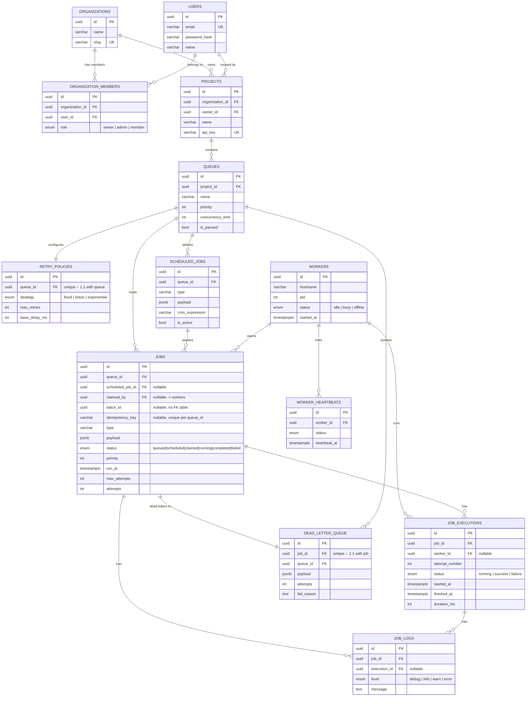

# Distributed Job Scheduler

Production-inspired distributed job scheduling platform: multi-tenant projects/queues, a REST API, a
worker service that atomically claims and executes jobs, and a monitoring dashboard.

## Status

Phase 1 (workspace + schema), Phase 2 (atomic claim engine, job lifecycle, heartbeats, zombie
cleanup), Phase 3 (REST API, auth, queue controls) and Phase 4 (recurring job chaining, dashboard)
are in place.

## Layout

- `backend-api/` — REST API (auth, projects, queues, jobs)
- `worker-service/` — polls queues, claims jobs, executes them, sends heartbeats
- `frontend-dashboard/` — web dashboard for queues, jobs, workers, metrics
- `packages/db/` — shared Drizzle schema + DB client used by both `backend-api` and `worker-service`

## System architecture

```
+-----------------------------+
|      frontend-dashboard        |
|   Vite + React (Vercel)        |
+---------------+-----------------+
                |  REST over JSON, polled every 4-5s
                v
+-----------------------------+
|          backend-api           |
|   Express (Render web service) |
+---------------+-----------------+
                |  Drizzle ORM (reads + writes)
                v
+-----------------------------------+
|            Postgres (Neon)           |
|  users, organizations, projects,     |
|  queues, jobs, job_executions,       |
|  job_logs, workers, dead_letter_queue|
+---------------+-----------------------+
                ^
                |  Drizzle ORM: SELECT ... FOR UPDATE SKIP LOCKED
                |
+---------------+-----------------+
|         worker-service             |
|   poll -> claim -> execute         |
|   (Render background worker,       |
|    scale out with N instances)     |
+-------------------------------------+
```

Every `ZOMBIE_CLEANUP_INTERVAL_MS` (default 10s), `backend-api`'s zombie-cleanup sweep reads
`workers.last_heartbeat_at` and reclaims jobs held by any worker that has gone stale — see
`DEVELOPMENT.md` for why that sweep lives in `backend-api` and not `worker-service`.

## Job lifecycle: Enqueued -> Dead Letter Queue

```
POST /api/projects/:projectId/jobs
                |
                v
+---------------------------------------------------------------+
|  ENQUEUED                                                        |
|   immediate -> status='queued',    run_at = now()                |
|   delayed   -> status='scheduled', run_at = <future timestamp>   |
|   recurring -> status='scheduled', run_at = first cron occurrence;|
|                cron_expression persisted as the baseline rule     |
+---------------------------------+-------------------------------+
                                   |
                                   |  worker poll loop (worker-service/src/claim.ts):
                                   |  SELECT ... WHERE status IN ('queued','scheduled')
                                   |    AND run_at <= now() AND queues.is_paused = false
                                   |  FOR UPDATE SKIP LOCKED
                                   v
+---------------------------------------------------------------+
|  CLAIMED   status='claimed', claimed_by=<worker id>, claimed_at   |
+---------------------------------+-------------------------------+
                                   |  execute.ts: INSERT job_executions (attempt N, 'running')
                                   v
+---------------------------------------------------------------+
|  RUNNING   status='running', started_at set                       |
+---------------------+-------------------------------------------+
                       |
          succeeds     |     throws
       +---------------+---------------+
       v                               v
+-----------------------+   +--------------------------------+
|  COMPLETED               |   |  attempts < max_attempts ?        |
|  status='completed'      |   +----------------+-----------------+
|  job_executions:         |                    | yes          | no
|    status='success'      |                    v              v
|                          |   +------------------------+  +---------------------------+
|  if cron_expression set: |   |  back to ENQUEUED         |  |  FAILED                      |
|  atomically insert the   |   |  status='queued'          |  |  status='failed'             |
|  NEXT occurrence as a    |   |  run_at = now + backoff(   |  |  + INSERT dead_letter_queue   |
|  new row, same           |   |  strategy, attempt) --     |  |    row: payload snapshot,      |
|  transaction as the      |   |  fixed / linear /          |  |    fail_reason, attempts        |
|  completion update       |   |  exponential                |  |  -- isolated from the live      |
+-----------------------+   +------------------------+  |    jobs table for triage         |
                                                          +---------------------------+
```

**Safety net, from any `claimed`/`running` state:** if a worker misses
`WORKER_HEARTBEAT_TIMEOUT_MS`, `backend-api`'s zombie-cleanup sweep marks it `offline` and
force-requeues its jobs — `status='queued'`, `claimed_by=NULL`, `run_at=now()`, attempts left
untouched (this is an infra failure, not a job failure). See `DEVELOPMENT.md` for the full design
trace on how this, queue pausing, and cron chaining all interact at the database level.

## Data model

`Organization` → `Project` → `Queue` → `Job` is the tenancy/ownership chain. Every entity named in
the assignment brief is its own table — retry configuration, worker heartbeats, and recurring-job
rules were originally columns on other tables and were split out into `retry_policies`,
`worker_heartbeats`, and `scheduled_jobs` respectively (see `DEVELOPMENT.md` for why, and what that
migration had to preserve). Full column-level detail (types, defaults, indexes) is in
`packages/db/src/schema.ts`, the source of truth this diagram mirrors.



## Setup

1. `npm install` at the repo root (installs all workspaces).
2. Provision a Postgres database and set `DATABASE_URL` in `backend-api/.env` and
   `worker-service/.env` (copy from the respective `.env.example`).
3. `npm run db:generate -w packages/db` then `npm run db:migrate -w packages/db` to create the schema.
4. `npm run build -w packages/db` — compiles the shared schema/client to `packages/db/dist`.
   **Required**, not optional: `backend-api`/`worker-service` resolve `@scheduler/db` through its
   `package.json` `main`/`types` fields, which point at the compiled output, not the TypeScript
   source — re-run this any time you edit `packages/db/src/*`. `npm run dev:api` / `dev:worker`
   below do this automatically at startup, so this step mainly matters if you're running
   `tsc`/`npm run typecheck` directly against `backend-api` or `worker-service` before ever starting
   either dev server.
5. `npm run dev:api` and `npm run dev:worker` (separate terminals) to run the API and a worker.
6. Copy `frontend-dashboard/.env.example` to `.env` (sets `VITE_API_BASE_URL`), then
   `npm run dev:frontend` and open the printed localhost URL. On first load you'll land on a
   sign-up screen — creating an account also creates an organization, a default project, and a
   default queue for you in one step, so there's nothing to manually configure before the
   dashboard shows live data.

## Multi-tenancy model

`Organization` → `Project` (many) → `Queue` (many) → `Job` (many). Every `/api/projects/:projectId`
request is checked against the authenticated caller's `organizationId`: a project that exists but
belongs to a different organization returns `403`; one that doesn't exist returns `404`. Queues and
jobs are always reached through their parent project — a `queueId` belonging to another project
returns `404` rather than leaking its existence.

Signup auto-creates one project with one queue so a fresh workspace is immediately usable, but
neither is a ceiling: `POST /api/projects` and `POST /api/projects/:projectId/queues` add more of
each, gated by role (see "Role-based access control").

## Authentication

Requests must carry `Authorization: Bearer <jwt>`, where the JWT payload is
`{ userId, organizationId }` signed with `JWT_SECRET`. Get a token via:

- `POST /api/auth/signup` — `{ email, password, organizationName, name? }`. Creates a `User`, an
  `Organization` owned by them (as `role: "owner"`), a `Default Project`, and a `default` `Queue`,
  all in one transaction, then returns `{ token, user, organization, project, role }`. `409
  email_taken` if the email is already registered.
- `POST /api/auth/login` — `{ email, password }`. Verifies the bcrypt hash and returns the same
  shape (including `role`, looked up from `organization_members`), using the caller's first
  (oldest) organization membership. `401 invalid_credentials` on any mismatch (never reveals which
  part was wrong).
- `GET /api/auth/me` — requires a valid `Bearer` token; returns `{ user, organization, project,
  role }` for session rehydration (`frontend-dashboard` calls this once on load to validate a
  stored token before trusting it).

`role` is one of `owner` / `admin` / `member`, from `organization_members.role` — see "Role-based
access control" below for what each can do.

`frontend-dashboard` uses this flow directly — see "Frontend dashboard" below.

For local scripting/testing without going through signup, `backend-api/.env` also supports
`MOCK_AUTH=true`, which accepts `x-mock-user-id` / `x-mock-organization-id` headers instead of a
JWT for any *existing* organization id. **Never set this in a deployed environment** — it lets
anyone who knows an organization's id act as that org.

## Role-based access control

`organization_members.role` is `owner`, `admin`, or `member`. The `requireRole(...)` middleware
(`backend-api/src/middleware/rbac.ts`) looks the caller's role up on every gated request and
returns `403 insufficient_role` if it isn't in the allow-list, or `403 not_a_member` if the caller
has no membership row in the organization at all.

The split is by *structural* vs. *operational* change:

| Action | Required role |
|---|---|
| Create / rename / delete a project | `owner`, `admin` |
| Create / update a queue's config (name, priority, concurrency, retry policy) | `owner`, `admin` |
| Pause / resume a queue, enqueue/retry/batch-create jobs | any role (`owner`, `admin`, `member`) |

Structural changes reshape what exists; operational ones just push work through what's already
there — an on-call `member` should be able to pause a misbehaving queue or retry a failed job
without needing `admin` first.

## API

All responses are JSON. Errors use a structured shape:

```json
{ "error": { "code": "queue_not_found", "message": "Queue ... not found in this project", "details": null } }
```

### `POST /api/auth/signup`, `POST /api/auth/login`, `GET /api/auth/me`

Public (no token required for signup/login). Full request/response shapes are in "Authentication"
above. Every endpoint below this point requires `Authorization: Bearer <jwt>` from one of these.

### `POST /api/projects/:projectId/jobs`

Enqueues a job. `type` is the job *handler* name (e.g. `"send-welcome-email"`) — kept independent
of `schedule.mode`, which only controls when the job first becomes eligible for claiming. This
separation is what lets a future handler registry dispatch on `type` without touching scheduling.

```jsonc
// request body
{
  "type": "send-welcome-email",
  "queueId": "3fa2...uuid",
  "payload": { "userId": "123" },        // optional, default {}
  "priority": 0,                          // optional, default 0, higher claims first
  "maxAttempts": 3,                       // optional, default 3
  "schedule": {                           // optional, default { "mode": "immediate" }
    "mode": "immediate"
  },
  "idempotencyKey": "order-123"           // optional, also accepted as an Idempotency-Key header
}
```

`schedule` supports four modes:

| mode        | extra fields                       | resulting `run_at`              | initial `status` |
|-------------|-------------------------------------|----------------------------------|-------------------|
| `immediate` | —                                    | now                              | `queued`          |
| `delayed`   | `delayMs` (positive integer)         | now + `delayMs`                  | `scheduled`       |
| `scheduled` | `runAt` (ISO date, must be future)    | `runAt`                          | `scheduled`       |
| `recurring` | `cronExpression` (standard cron)     | first computed occurrence        | `scheduled`       |

`delayed` and `scheduled` are deliberately distinct: `delayed` takes a relative offset from now
("run in 10 minutes" — the caller doesn't compute a timestamp), `scheduled` takes an absolute
point in time ("run at 2026-08-01T10:00:00Z"). Both land the job in `status: 'scheduled'`; only how
`run_at` is expressed differs.

For `recurring`, the cron expression is parsed with `cron-parser` and persisted on the job row as
the baseline rule. This endpoint schedules only the **first** occurrence; `worker-service` chains
every occurrence after that itself — see `DEVELOPMENT.md` for the mechanism.

If `idempotencyKey` is supplied and a job already exists on this queue with the same key, that
existing job is returned as-is (`200`, not `201`) instead of inserting a duplicate — this is what
makes retrying a `POST /jobs` call safe after a client-side timeout. Jobs created without a key are
never deduped against anything (`jobs_queue_id_idempotency_key_idx` is a unique index on
`(queue_id, idempotency_key)`, and Postgres treats every `NULL` as distinct).

Response: `201 { "data": <job row> }` (or `200 { "data": <job row>, "idempotent": true }` on an
idempotency-key replay). `404 queue_not_found` if `queueId` isn't in this project. `400
run_at_in_past` if the resolved run time isn't in the future. `400 invalid_cron_expression` if the
cron string doesn't parse.

### `GET /api/projects/:projectId/jobs`

Paginated, filterable job search, scoped to the project.

Query params: `page` (default 1), `pageSize` (default 20, max 100), `queueId?`, `status?` (one of
`queued`/`scheduled`/`claimed`/`running`/`completed`/`failed`), `from?`/`to?` (ISO dates, filter on
`createdAt`).

```json
{
  "data": [ /* job rows */ ],
  "pagination": { "page": 1, "pageSize": 20, "total": 143, "totalPages": 8 }
}
```

### `POST /api/projects/:projectId/jobs/batch`

Enqueues many immediate jobs on one queue in a single transaction, sharing a generated `batchId`.

```jsonc
// request body
{
  "queueId": "3fa2...uuid",
  "jobs": [
    { "type": "send-email", "payload": { "to": "a@example.com" } },
    { "type": "send-email", "payload": { "to": "b@example.com" } }
  ] // 1-500 entries; each accepts payload?/priority?/maxAttempts? same as POST /jobs
}
```

Response: `201 { "data": { "batchId": "...", "count": 2, "jobs": [ /* job rows */ ] } }`.

### `POST /api/projects/:projectId/jobs/:jobId/retry`

Manually forces a `failed` (dead-lettered) job back to `queued`: attempts reset to `0`, immediately
claimable, and any existing `dead_letter_queue` row for it is cleared (it can dead-letter again
under a fresh set of attempts). `400 job_not_retryable` if the job isn't currently `failed`.
Response: `200 { "data": <job row> }`.

### `GET /api/projects`, `POST /api/projects`

Org-scoped: list every project in the caller's organization, or create an additional one (`{
"name": "..." }`, requires `owner`/`admin` — see "Role-based access control"). A project created
this way starts with **zero** queues; add its first with `POST .../queues` below. Response:
`200 { "data": <project row>[] }` / `201 { "data": <project row> }`.

### `GET /api/projects/:projectId`, `PATCH /api/projects/:projectId`, `DELETE /api/projects/:projectId`

Get, rename (`{ "name": "..." }`, `owner`/`admin`), or delete (`owner`/`admin`) one project.
Deleting cascades through `queues → jobs → {executions, logs, dead_letter_queue}` and
`scheduled_jobs`/`retry_policies` (all `ON DELETE CASCADE` in `schema.ts`) — the one genuinely
destructive endpoint in the API. Response: `200 { "data": <project row> }` for GET/PATCH, `204` for
DELETE.

### `POST /api/projects/:projectId/queues/:queueId/pause`

Sets `queues.is_paused = true`. Jobs already `claimed`/`running` are unaffected — this only stops
*new* claims. Takes effect on the worker's very next poll cycle (see the design trace in
`DEVELOPMENT.md`). Response: `200 { "data": <queue row> }`.

### `POST /api/projects/:projectId/queues/:queueId/resume`

Clears `is_paused`. Same response shape as pause.

### `GET /api/projects/:projectId/queues`

Lists the project's queues (config + `isPaused`), ordered by priority descending. Backs the
dashboard's Queue Configuration Matrix. Each row's retry configuration is a nested `retryPolicy`
object (`{ strategy, maxRetries, baseDelayMs }`) — it lives in its own `retry_policies` table (see
"Data model"), flattened onto the queue in the API response so clients don't need to know that.

```json
{ "data": [{ "id": "...", "name": "emails", "isPaused": false, "retryPolicy": { "strategy": "exponential", "maxRetries": 3, "baseDelayMs": 500 } }] }
```

### `POST /api/projects/:projectId/queues`

Adds a queue to an existing project (requires `owner`/`admin`) — the piece missing before this
was added, when a project's only queue was the one made automatically at signup. Creates the queue
and its 1:1 retry policy in one transaction.

```jsonc
// request body
{
  "name": "emails",
  "priority": 0,                 // optional, default 0
  "concurrencyLimit": 1,         // optional, default 1
  "retryPolicy": {                // optional, defaults shown
    "strategy": "exponential",   // "fixed" | "linear" | "exponential"
    "maxRetries": 3,
    "baseDelayMs": 1000
  }
}
```

Response: `201 { "data": <queue row, shaped like GET /queues> }`.

### `PATCH /api/projects/:projectId/queues/:queueId`

Updates the config fields that used to be frozen after creation — `name`, `priority`,
`concurrencyLimit`, and the linked retry policy (any subset; requires `owner`/`admin`). Pause/
resume stay their own endpoints above since they're a high-frequency operational toggle, not a
config edit. Response: `200 { "data": <queue row> }`. `404 queue_not_found` if `queueId` isn't in
this project.

### `GET /api/projects/:projectId/queues/:queueId/stats`

Per-queue breakdown — job counts by status, dead-letter total, and average duration of successful
executions — as opposed to `GET /metrics` below, which only ever aggregates across every queue in
the project.

```json
{
  "data": {
    "queueId": "...",
    "jobCounts": { "queued": 2, "scheduled": 0, "claimed": 0, "running": 1, "completed": 40, "failed": 1 },
    "deadLetterCount": 1,
    "avgDurationMs": 842
  }
}
```

### `GET /api/projects/:projectId/jobs/:jobId/logs`

Full `job_logs` trace for one job, oldest first — the Job Explorer's slide-out detail panel.
`404 job_not_found` if the job isn't in this project. Response: `200 { "data": <job_log row>[] }`.

### `GET /api/projects/:projectId/metrics`

One aggregate read for dashboard tiles/charts instead of the frontend firing a paginated `GET
/jobs` call per status: job counts by status plus the dead-letter total.

```json
{
  "data": {
    "queueCount": 3,
    "jobCounts": { "queued": 2, "scheduled": 1, "claimed": 0, "running": 1, "completed": 40, "failed": 3 },
    "deadLetterCount": 3
  }
}
```

### `GET /api/workers`

Fleet-wide worker roster (id, hostname, pid, status, lastHeartbeatAt). **Not** scoped to
`:projectId` — the `workers` table has no tenant column (see DEVELOPMENT.md): a single worker
process polls and claims across any org/project's queues, so "this project's workers" isn't a
concept the schema supports. Response: `200 { "data": <worker row>[] }`.

## Frontend dashboard

`frontend-dashboard/` is a Vite + React 19 + TypeScript + Tailwind CSS v4 SPA (`recharts` for
charts), talking to `backend-api` over the REST API above via real `Authorization: Bearer` auth —
no server-side rendering, no separate backend-for-frontend.

- **Auth**: `src/components/AuthScreen.tsx` (login/signup toggle) + `src/hooks/useAuth.ts` +
  `src/auth.ts` (session storage). Signing up calls `POST /api/auth/signup` and stores the
  returned `{ token, user, organization, project, role }` in `localStorage`; every subsequent API
  call sends `Authorization: Bearer <token>` (`src/api/client.ts`). On load, a stored token is
  validated against `GET /api/auth/me` before being trusted — an expired or revoked token drops
  back to the login screen instead of silently showing broken data. `role` gates which project/
  queue management actions the UI shows (see "Role-based access control" above).
- **Account panel** (`src/components/AccountPanel.tsx`): lists every project in the org
  (`GET /projects`), switches the dashboard's active project client-side (no re-login —
  `useAuth`'s `switchProject` just repoints `session.project`), and — for `owner`/`admin` only —
  renames, deletes, and creates projects. A `member` sees the same list read-only.
- **Design tokens** live in `src/index.css` as a Tailwind v4 `@theme` block: `sand` (canvas),
  `olive`/`olive-dark` (brand/primary actions), `sage` (secondary highlight), `terracotta`/
  `terracotta-light` (alerts, dead-letter counts). Glass tiles are a shared `<GlassCard>` component
  (`bg-white/70 backdrop-blur-md border border-white/40`, diffuse shadow) rather than a duplicated
  className string.
- **Layout**: `Layout.tsx` + `Sidebar.tsx` — a static left sidebar on desktop (`md:` and up), a
  slide-in drawer behind a hamburger button below that breakpoint. Content grids collapse from
  3/2 columns down to 1 via Tailwind's responsive column classes, no separate mobile markup.
- **Pages** (`src/App.tsx`, tab-based, no router — three tabs don't need one): **Overview**
  (`ClusterHealth` + `ThroughputChart`), **Queues** (`QueueMatrix` — pause/resume, a "+ New queue"
  card and a per-card "Edit" form for `owner`/`admin`, and an on-demand "Stats" panel backed by
  `GET .../queues/:queueId/stats` for every role), **Jobs** (`JobExplorer` + `JobDetailPanel`
  slide-out, with a "Retry" action on failed jobs).
- **Data fetching**: a small custom `usePolling` hook (5s for queues/workers/metrics, 4s for the
  job grid) — no React Query/SWR dependency, since three polled resources didn't justify one.
- **Chart palette**: the throughput chart does *not* use the brand's exact
  `#C0CFC0`/`#E5CEC6`/`#DDA28F` — those read as near-gray and fail CVD-safety at the hex level (see
  DEVELOPMENT.md). It uses deepened variants of the same three hue families instead, validated with
  the dataviz skill's palette checker.
- Env: `VITE_API_BASE_URL` (see `.env.example`). Scripts: `npm run dev:frontend` (root) or
  `dev`/`build`/`preview`/`typecheck` inside `frontend-dashboard/`.

## Testing

Real integration tests against a real Postgres — no mocked database, since the whole point is
verifying atomic claiming, retry/backoff math, and crash recovery actually work at the database
level, not that a mock was configured correctly.

1. `createdb scheduler_test` (or point `TEST_DATABASE_URL` at any throwaway Postgres database).
2. `npm test` from the repo root — builds `packages/db`, then runs `backend-api`'s and
   `worker-service`'s suites. Each suite's `beforeAll` applies migrations to the test DB
   automatically (idempotent, safe to leave running across multiple `npm test` invocations).

What's covered, each directly exercising a mechanic this project depends on for correctness:

- **`worker-service/src/__tests__/claim.test.ts`** — 5 concurrent `claimJobs()` calls race the same
  single queued row; asserts exactly one wins (`FOR UPDATE SKIP LOCKED` under a real race, not a
  simulated one).
- **`worker-service/src/__tests__/execute.test.ts`** — a job configured to always fail: asserts the
  fixed-backoff `run_at` math is correct to within a small tolerance, then that exhausting
  `max_retries` produces a `failed` status and a matching `dead_letter_queue` row. A second case
  asserts a successful run never touches either.
- **`backend-api/src/__tests__/zombieCleanup.test.ts`** — a `running` job under a worker whose most
  recent heartbeat is aged past the timeout: asserts the sweep reverts it to `queued` with attempts
  *preserved* and marks the worker `offline`. A second case asserts a worker with a fresh heartbeat
  is left untouched.
- **`backend-api/src/__tests__/rbac.test.ts`** — calls `requireRole(...)` directly against a real
  `organization_members` row: asserts a listed role calls `next()` clean and stamps `req.context
  .role`, an unlisted role calls `next(ApiError 403 insufficient_role)`, and a caller with no
  membership row at all gets `403 not_a_member`.
- **`backend-api/src/__tests__/idempotency.test.ts`** — asserts the `jobs_queue_id_idempotency_key
  _idx` unique index actually enforces what `POST /jobs` depends on: a second insert reusing a key
  on the same queue is rejected (Postgres `23505`), the same key on a *different* queue is not a
  collision, and any number of keyless jobs on one queue coexist (`NULL <> NULL` in a unique index).

Each test creates its own organization/project/queue/worker fixtures (unique names per run) and
deletes them in `afterEach` — safe to run repeatedly with no manual cleanup.

## Deployment

- **Neon (Postgres)**: create a project and copy a connection string. Either the direct or the
  pooled (`-pooler`) string works — `packages/db`'s client sets `prepare: false` specifically so
  pooled (PgBouncer transaction-mode) connections are safe here; see `DEVELOPMENT.md`. Run
  migrations once against it: `DATABASE_URL=<neon-connection-string> npm run db:migrate -w
  packages/db`.
- **Render**, two services from this repo. For both, **leave Root Directory blank** (repo root) —
  do **not** set it to `backend-api`/`worker-service`. This is an npm workspaces monorepo:
  `backend-api` depends on `@scheduler/db` as a workspace package, which only resolves when
  `npm install` runs from the repo root. Setting Root Directory to the service's own subdirectory
  makes `npm install` try to fetch `@scheduler/db` from the public npm registry and fail.
  - `backend-api` — Web Service. **Language: Node** (not Docker — there's no Dockerfile in this
    repo). Build: `npm install && npm run build:api`. Start: `npm run start -w backend-api`.
    Health Check Path: `/health`.
  - `build:api` (root `package.json`) builds `packages/db` first, then `backend-api` — required
    because `@scheduler/db`'s `package.json` points `main`/`types` at its compiled output, not raw
    TypeScript, so plain `node dist/index.js` (what every entrypoint runs in production) needs
    that output to exist. See `DEVELOPMENT.md` for what happens if you skip this.
- **`worker-service` runs on GitHub Actions instead of Render**, for genuinely zero cost. Render's
  Background Worker has no free tier ($7/mo minimum) and Render Cron Jobs bill per second of
  compute even if small — GitHub Actions is free with **no cost ceiling at all on a public repo**.
  `.github/workflows/worker-cron.yml` runs on a `*/5 * * * *` schedule (plus `workflow_dispatch` for
  manual runs from the Actions tab): checks out the repo, builds `packages/db` and `worker-service`,
  and runs `node worker-service/dist/runOnce.js` — the same one-shot entrypoint described below,
  just triggered by GitHub's scheduler instead of Render's.
  - **Setup**: in the GitHub repo, go to Settings → Secrets and variables → Actions → New repository
    secret, add `DATABASE_URL` with your Neon connection string. That's the only configuration
    needed; the workflow file is already committed.
  - `src/runOnce.ts` claims and executes everything currently due, looping until a pass claims
    nothing (bounded by `MAX_RUN_MS`), then exits — instead of polling forever like a real
    Background Worker would. Trade-off: job pickup latency becomes "up to the schedule interval"
    (~5 min here) instead of ~1s. See `DEVELOPMENT.md` for why a single invocation loops rather than
    doing one pass, and for the two Render alternatives (Cron Job, Background Worker) if you'd
    rather keep everything on one platform and are fine with either the small per-run cost or the
    flat $7/mo.
- **Vercel**: `frontend-dashboard`, with Root Directory set to `frontend-dashboard` — this one's
  fine as a subdirectory root, since the frontend has no workspace-linked dependencies (only
  `react`/`react-dom`/`recharts`). Vercel auto-detects the Vite build (`vite build`, output `dist`).

### Environment variables

| Service | Platform | Variable | Required | Notes |
|---|---|---|---|---|
| `backend-api` | Render | `DATABASE_URL` | yes | Neon connection string, direct or pooled |
| `backend-api` | Render | `PORT` | no | Render injects this itself |
| `backend-api` | Render | `JWT_SECRET` | yes | generate with `openssl rand -base64 48` |
| `backend-api` | Render | `CORS_ORIGIN` | yes | your Vercel URL, e.g. `https://your-app.vercel.app` (comma-separate for multiple) |
| `backend-api` | Render | `MOCK_AUTH` | no | **omit entirely** — never set in production |
| `backend-api` | Render | `WORKER_HEARTBEAT_TIMEOUT_MS` | no | default `15000` |
| `backend-api` | Render | `ZOMBIE_CLEANUP_INTERVAL_MS` | no | default `10000` |
| `worker-service` | GitHub Actions | `DATABASE_URL` | yes | repo secret: Settings → Secrets and variables → Actions |
| `worker-service` | (n/a, defaults used) | `HEARTBEAT_INTERVAL_MS` | no | default `5000` — only settable if self-hosting (Render/locally), GitHub Actions workflow doesn't pass it |
| `worker-service` | (n/a, defaults used) | `MAX_CLAIM_PER_QUEUE` | no | default `5`, same as above |
| `worker-service` | (n/a, defaults used) | `MAX_RUN_MS` | no | default `45000`, same as above — comfortably under the workflow's 5-min schedule |
| `frontend-dashboard` | Vercel | `VITE_API_BASE_URL` | yes | Render `backend-api` URL + `/api` |
| `frontend-dashboard` | Vercel | `VITE_API_BASE_URL` | yes | Render `backend-api` URL + `/api` |

Each service's `.env.example` carries the same guidance inline.

## Documentation

- Architecture diagram — see "System architecture" above
- Job lifecycle diagram — see "Job lifecycle" above
- ER overview — see "Data model" above (column-level detail: `packages/db/src/schema.ts`)
- Design decisions & trade-offs — see `DEVELOPMENT.md`

